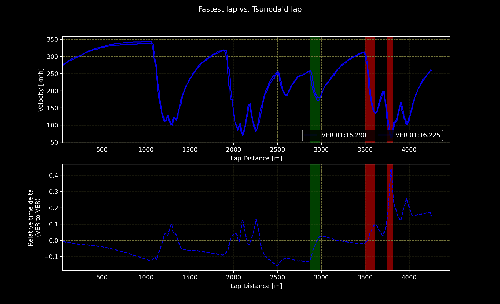
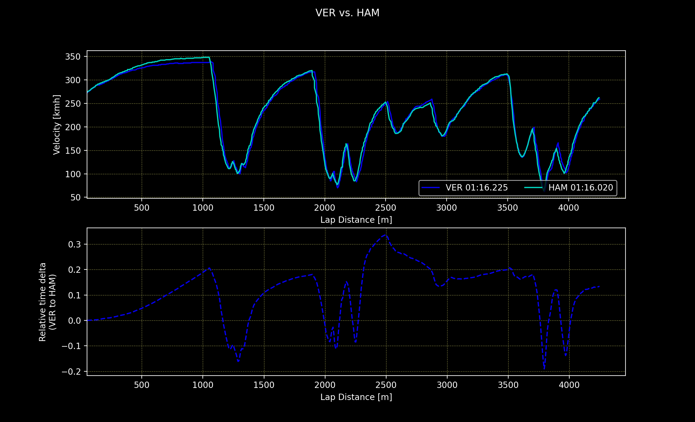

Was Mex Verstappen Tsunoda'd on his last lap in qualifying for the Mexican GP as suggested by Christian Horner?
On final lap Max wasn't able to improve, as Yuki Tsunoda had an off track right at the turn Max was arriving at.
There were no yellow flags, but there was much confusion as Yuki caused Perez to go off track too.  
In the end here was no point loss for Max in championship battle, as went on to win the race, however confusion arose to Christian Horner's words, as they were very unsupportive for Red Bull Junior Driver Program protégé.  
Did Yuki and Perez caused distraction to Max, as they were rejoining the track? do they actually cost him some time? How much?
Let's answer that question.  
  
Mentioned event happened in Q3 on Max' 33rd lap in the session. Let's compare this lap to his best lap - No. 30, which gave him third place on the grid for the race with time of 1:16.225.

In the green highlight the place on the track, turn 10, where Max was supposedly Tsunoda'd is shown. From relative delta we can judge that it costed Max just shy of 0.2s. However, even though he was still as fast as he was on his best lap to this point or even slightly gaining at the end of the straight. What cost him more are mistakes made later - braking for turn 12 and lockup at the stadium.  
It is worth noting that in the previous big braking zones Max was also loosing some time comparing to his best lap. It seems very likely that Max was more distracted by chaos happening on the track than actually lost some big time.

Let's also see how close was Max to Hamilton's P2 with 1:16.020.

It quickly becomes clear how big advantage Mercedes has on the straights even at altitudes they are racing at in Mexico. In each of the straight there is about 0.2s to the benefit of Silver Arrows. It also became clear that almost exactly at the time it happened Max was at the lap that could give him P2 over Lewis Hamilton. 
  
Comparing these two charts we can conclude that Yuki Tsunoda was guilty of a distraction, that if didn't happen, would close gap Max had to Lewis in the qualifying to the Mexican GP. 