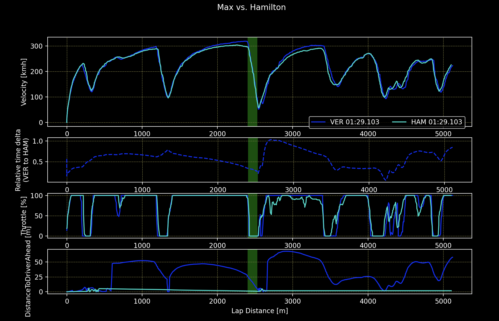
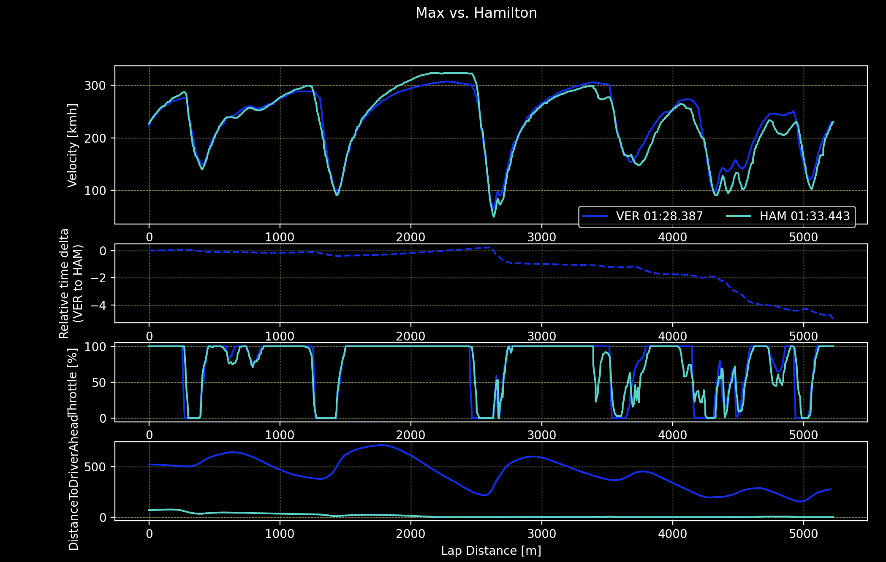
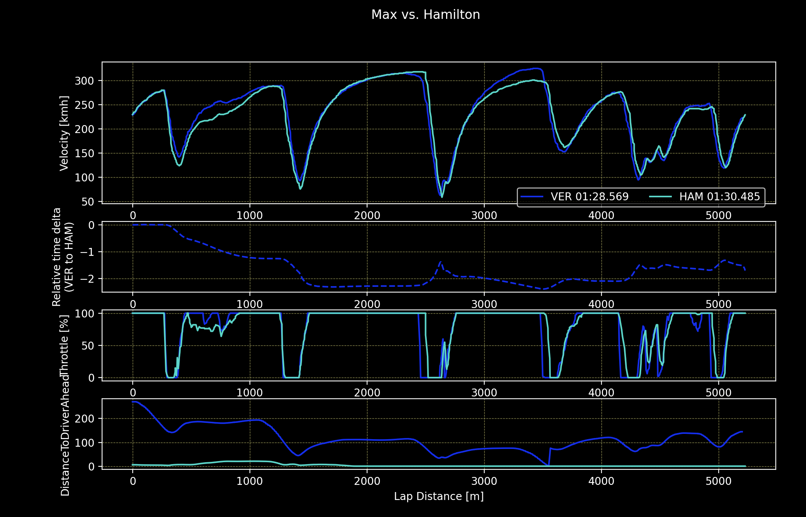
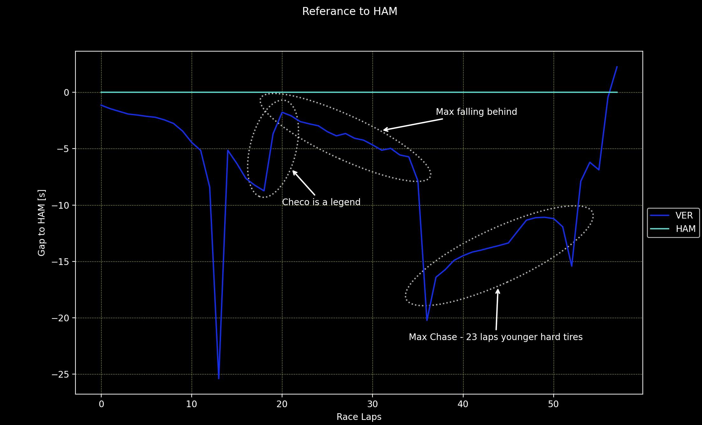
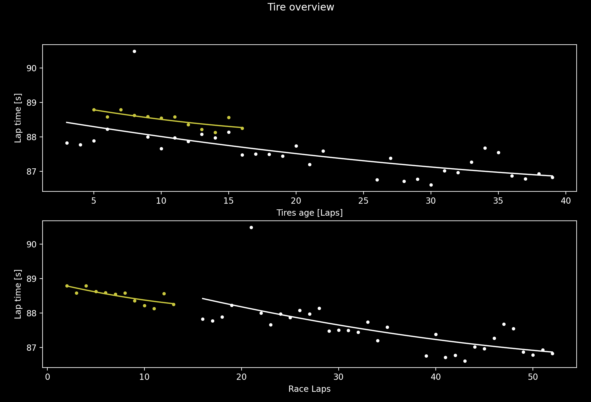
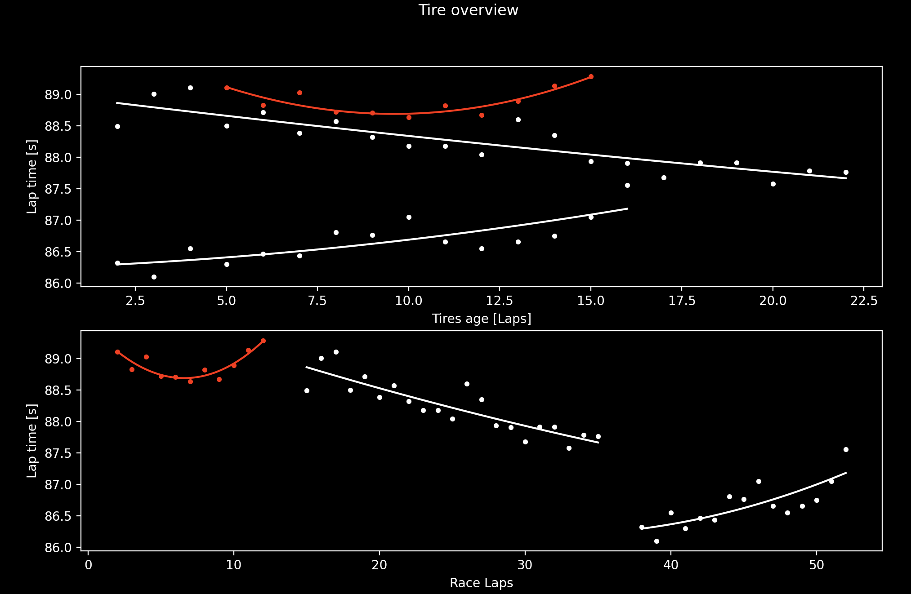
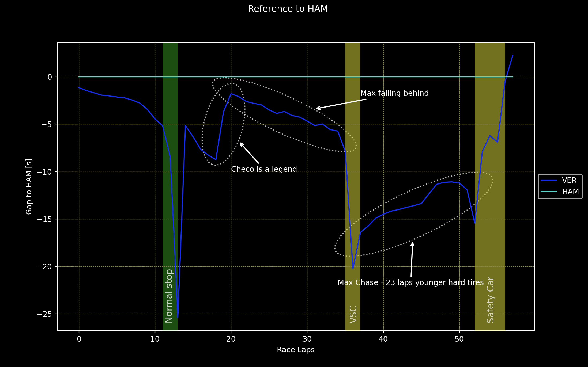
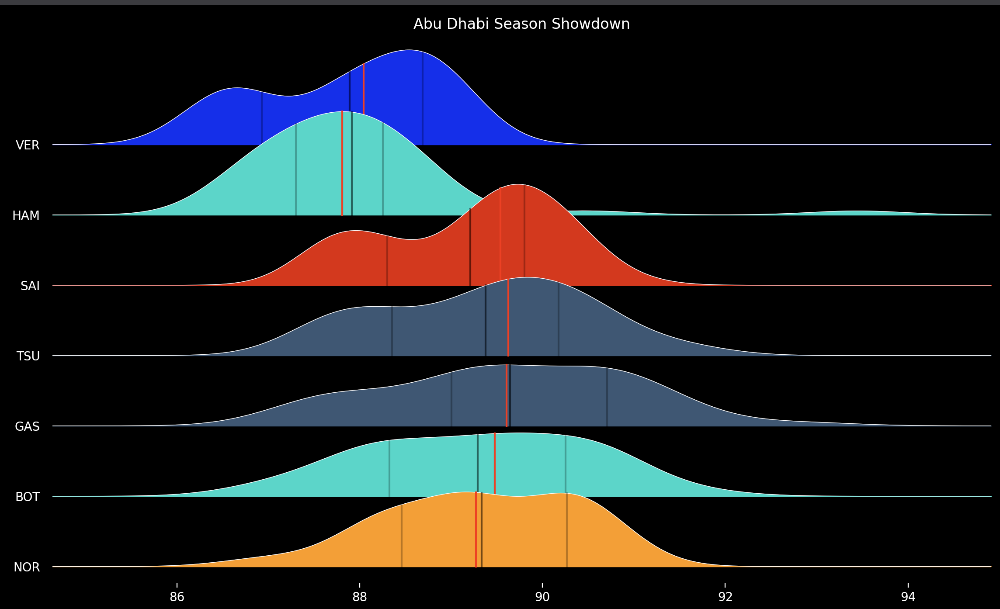

Season showdown has been a very controversial and emotion packed finale. Let's try to decompose that race and see how really Max vs. Lewis battle look like in Abu Dhabi. If you still haven't seen my take on qualifying battle you can find it [here.](https://michalcie.github.io/pyF1/pyf1/2022-01-06-AbuDhabi-TowOrNotToTow.html) 

It all started with very good start from Lewis Hamilton (or a bad one from Max). And all the way until turn 9 it was going free and controversy free. At T9 Lewis was force a bit wide by quite late dive by Max Verstappen. Max managed to keep the car within white line, while Lewis had to bail out in the run-off area. The first big controversy of the race was stewards' decision - no action necessary. We'll have quick look into that - let's overlay first lap telemetry: speed, delta and distance to driver ahead.  



In the green section I have highlighted a braking zone just before the overtake attempt. We can see that right before braking zone max was about 20 m behind and in the braking zone the distance melted to 0, and even for a moment Max was ahead.  
The big question that comes to my mind is 'Did Hamilton gave the advantage back to Verstappen?'. From throttle trace we can clearly see that he was allowing Max to get closer and in the following turn he reduced the gap significantly from almost 75 meters (or relative delta of 1.0s) to about 15 meters (0.35s), which is about the same we could see just before braking zone to turn 9. What is more interesting and what I don't recall from watching the broadcast, they got really close a bit later - according to telemetry the gap was reduced to almost 0! To me, it seems that the advantage (not the position) was given back to Max. Should Hamilton give the position to Verstappen? According to stewards - no. Looking from how far behind max was diving I probably need to agree.  
  
From this point forward, the race (and the championship) was pretty much Hamilton's. It was Max who needed to catch up and hope for the miracle (and maybe some teammate's help). Speaking of teammate's help let's see if Checo is really a legend [if you missed it.](http://livetiming.formula1.com/static/2021/2021-12-12_Abu_Dhabi_Grand_Prix/2021-12-12_Race/TeamRadio/MAXVER01_33_20211212_133443.mp3) 

We'll do it twofold: From the telemetry data from race lap 20 & 21, as well as we'll try to see what impact it made on the whole race. Let's start with telemetry.  

Lap 20:


Lap 21:  


Lewis has chased and caught Sergio on lap 20, right around 2600 meter mark. From that point we can see that the gap Lewis had to Max was reduced by 5 second until the end of the lap. And that was not over! On lap 21 the gap was brought down by over another 2 seconds until Lewis finally passed Sergio Perez. Perez took a huge chunk of the gap in just a little over 1 lap distance - it really is impressive given that at the moment Max seemed to be back in the contention for the championship - have taken hard tire after pitting earlier than Lewis and being just behind him in the race.  
Let's see how it looked like from the perspective of the whole race.



Checo really helped Max to get some advantage - probably it was a one of the reason for the early stop, but is seems that it was clearly not enough, as Max was falling behind Lewis and round about lap 30 it was known that some miracle or unexpected turn of events will be needed if Max is to become world champion. And what happened later was a Virtual Safety Car. With Max clearly falling behind Red Bull pitted Max for a new set of tires that were 23 laps younger that the set Lewis Hamilton was driving on and that should allow him to chase down Lewis. After the VSC period has ended Max was able to start closing the gap to Hamilton, but it was not fast enough. Even if Max would keep this pace advantage, he would run out laps remaining it the race before he could catch Lewis on the track. Once again situation seemed hopeless for the dutchman and another miracle was needed. The miracle happened with 5 laps to go and a few controversial decisions later. With Safety car deployed, after Latifi's crash, Max changed tires to softs and waited for the restart. With controversy about race director's decision that allowed lapped cars between Lewis and Max to unlap themselves, Lewis was a sitting duck and with a racing resumed for the last lap, Max overtook Lewis for the championship.

To breakdown the controversy we can use Race Control messages.


>        2021-12-12 14:21:54:
>            Lap: 53
>            Category: "SafetyCar",
>            Status: "DEPLOYED",
>            Mode: "SAFETY CAR",
>            Message: "SAFETY CAR DEPLOYED"
>            
>        2021-12-12 14:27:55:
>            Lap: 56,
>            Category: "Other",
>            Message: "LAPPED CARS WILL NOT BE ALLOWED TO OVERTAKE"
>            
>        2021-12-12 14:31:01: 
>            Lap: 57,
>            Category: "Other",
>            Message: "LAPPED CARS 4 (NOR) - 14 - 31 - 16 - 5 TO OVERTAKE SAFETY CAR"
>            
>        2021-12-12 14:31:19"
>            Lap: 57,
>            Category: "SafetyCar",
>            Status: "IN THIS LAP",
>            Mode: "SAFETY CAR",
>            Message: "SAFETY CAR IN THIS LAP"


The main talking point is change of the decision "LAPPED CARS WILL NOT BE ALLOWED TO OVERTAKE" to
"LAPPED CARS 4 (NOR) - 14 - 31 - 16 - 5 TO OVERTAKE SAFETY CAR". The fact that only certain cars were allowed to overtake Safety Car seems to be another controversy, as well as the fact that the Safety Car was being withdrawn on same lap on which lapped cars passed the leader. That, according to protest filed by Mercedes is not compliant with the rulebook that states:
```
        Article 48.12
            If ... safe to do so, and the message "LAPPED CARS MAY NOW OVERTAKE"
            has been sent to all Competitors ... any cars that have been lapped
            by the leader will be required to pass the cars on the lead lap and
            the safety car.  
            
            ...
            
            Unless the clerk of the course considers the presence of the safety car
            is still necessary, once the last lapped car has passed the leader
            the safety car will return to the pits at the end of the following lap.
```

The protest was dismissed with the justification that this part was overridden by:
```
       Article 48.13
            When ... it is safe to call in the safety car the message 
            "SAFETY CAR IN THIS LAP" will be sent to all Competitors ... 
            This will be the signal to the Competitors and drivers that 
            it will be entering the pit lane at the end of that lap.
            
        Article 15.3
        ... The Race Director shall have overriding authority in the following
        matters...:
            ...
            e) The use of the safety car.
```
  
Quite a bitter end to a wonderful race.  

Before jumping to the conclusion from the race let's have a quick look at the tires used in the race.  
Tires for Lewis:
  

Tires for Max:


A quick note before we start - in the charts above only valid laps are used (No laps under SC, VSC, etc.), that's why the laps that Max was driving on his final set of soft tire are not present in the data.  
First thing that can be noticed is how much performance of soft tires was dropping in the first stint for Max - it seems that the decision made during Q2  - to run again with soft tires after flat spotting medium tire paid its toll. 

Despite the race being a championship decider it was a very interesting race for one more reason.
On the example of Max Verstappen we could see how much can be gained by pitting under Virtual Safety Car or standard Safety Car - In this race Max has pitted three times: a normal stop, VSC stop, and a Safety Car stop.



We can roughly estimate that in this case a normal stop was about 21 seconds, VSC stop was around 13 seconds and a stop under a Safety Car was pretty much free and even reduced the gap and have won Max a championship. 

Despite the race being very controversial in terms of stewarding, we got to see many ups and downs in one race. It kept me at the edge of the sofa almost all the time. And If I could sum it up I would say this race was all that the motorsport is: Unpredictable sport, were high are very high and lows are rock bottom - and we got to see it all during 2021 Abu Dhabi GP.  
Of course, there must some action taken when it comes to stewarding as there can't be any confusion about procedures, lesson must be learnt and conclusions drawn, however it is part of the sport: I hope we will see many more emotion packed races.  
I believe that Max has earned the championship this year: He was pretty much faultless, had drove amazingly this season. There some bumps along the way, mostly with him exploiting rules boundaries and that combined with some inconsistent stewarding was a subject to a controversy, but I believe we cannot blame Max for doing all he could to win the championship. This said, Lewis Hamilton was clearly faster in Abu Dhabi GP. Well deserved championship for Max, but not the win he deserved.  



Pace of top seven is showed to justify my point about Hamilton being clearly faster in Abu Dhabi. Both Lewis and Max where in a class of its own. Only valid laps are taken into account. Red line is median time, black is mean, grey is 25th and 75th quantile respectively.