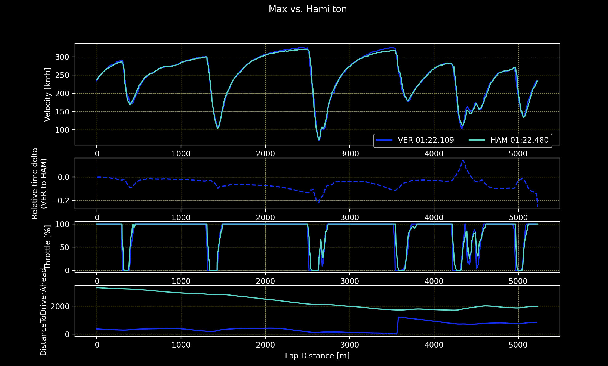

During qualifying for 2021 Abu Dhabi GP we could see some great team work by two Red Bull drivers giving each other a tow in Q3. It seems that it was a great way to close gap to Mercedes that was dominant in earlier sessions of the weekend.  
Let's see how the data look like where there was no tow. During the qualifying session it was quite hard to find good laps where the definitely was no tow, here is the comparison of Lewis' lap from Q1 and Max' lap from Q2

From relative delta we can judge that even though that the lap time difference is significant for F1 - almost 0.6s, it can be clearly seen that Red Bull is losing so much time on the long straights of Yas Marina circuit. In this instance is about 0.5s. That's a huge gap to be closed if Max should stay in contention for driver's championship.  

So now let's cut to the chase - the lap where Max was towed by his teammate - the tow can be seen by looking at the 'Distance to driver ahead'. 

First thing that comes to my mind is the both team put their drivers on the track with no traffic - Max had only Sergio Perez to overtake after being towed in sector one and two. Lewis, on the other hand, had the track to himself, there was no one in front of him for almost 2 kilometers! Interestingly, the tow seems to be very powerful. Max was gaining quite a bit compared no-tow laps - the difference compensated all gain Mercedes had is sectors one and two.