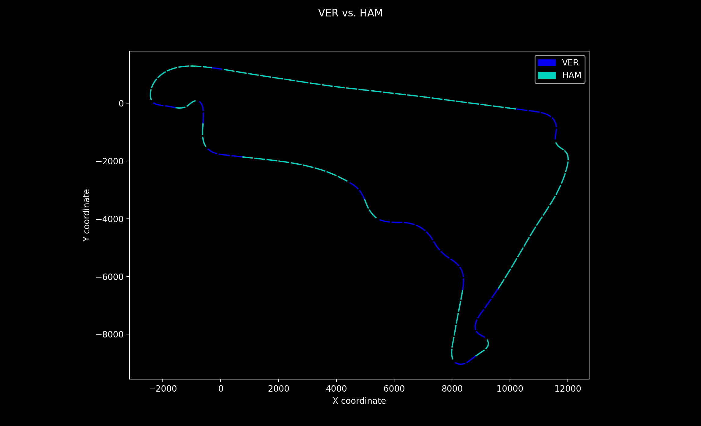
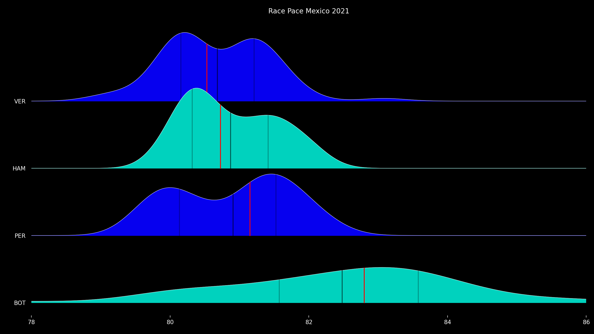

Something for F1 passionate. 

Checkout GitHub repository [ pyF1 repository](https://github.com/michalcie/pyF1)  
... or have a look at what it is used for <first post>

## Intro

pyF1 python project provides some functions that make analysing F1 a bit easier
It uses telemetry and other data provided by [fastf1 by theOehrly](https://theoehrly.github.io/Fast-F1/fastf1.html) and presents it
in a more digestible way. However, you can find here much more, as I will be posting
here some F1 related analysis with source code available in the repo - something for
real nerds. 


## Demo

A brief demonstration of what it is all about.

Let's see in which part of the track Max Verstappen was faster than Lewis Hamilton
during qualifying for Mexico GP 2021. We are comparing their fastest laps.  
We need to use following code:

```
from path.source import track_telemetry as tt
driver_list = ['VER', 'HAM']
laps, event = tt.crate_event(2021, 'Mexico', 'Q')
tt.overlay_map_multi(driver_list, laps)
```

The output is a plot with track map where mini sectors are colored depending
on who was faster.



That seems easy, so let's try something different.
Let's say that we would like to see how dominant was Red Bull over Mercedes in 2021 Mexico GP.
We can use this short code:
```
laps, event = tt.crate_event(2021, 'Mexico', 'R') 
drivers_list = ['VER', 'HAM', 'PER','BOT']
tt.ridgeline(drivers_list, laps, "Mexico 2021 - How Fast was Redbull?", None, None, 0)
```

The output is the following rigdeline  graph and console printout with basic statistical
info about distribution (median, average, quantile) of all valid laps driven in the race:



> Median:  
VER    80.5295  
HAM    80.727  
PER    81.151  
BOT    82.7985  
>
> Average:  
VER    80.681328  
HAM    80.873143  
PER    80.906313  
BOT    82.481466  
>  
>Quantile 25:   
VER    80.15575
HAM    80.3195  
PER    80.136  
BOT    81.57325  
>
>Quantile 75:   
VER    81.2125  
HAM    81.414  
PER    81.52525  
BOT    83.579

## Documentation
Some basic docs can be found in [documentation post](https://michalcie.github.io/pyF1/pyf1/2022-01-02-Docs.html)  

## License

Copyright 2022, michalcie

Built with theme gitbook  
[](https://jekyll-themes.com/jekyll-gitbook/)